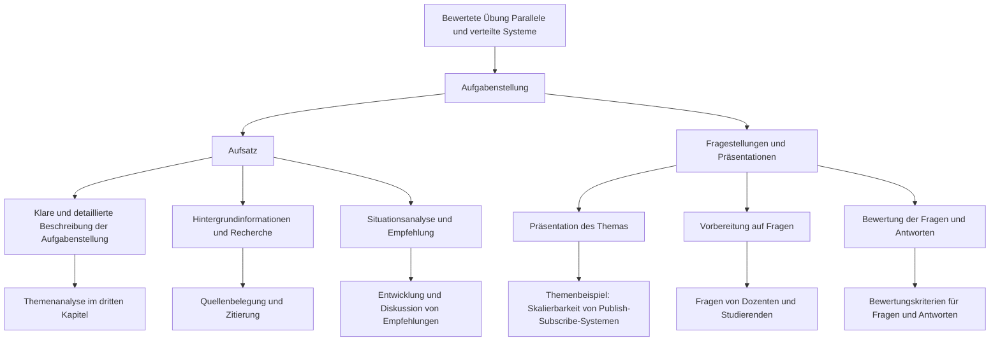

# Bewertete Übung «Parallele und verteilte Systeme»

## Aufgabenstellung
In Zweier- oder Dreiergruppen erarbeiten die Studierenden einen Aufsatz und eine Präsentation zu einem von mehreren gegebenen Themen.
Ziel ist es, ein verteiltes System zu analysieren, Vor- und Nachteile zu evaluieren und die im Unterricht behandelten Themen anzuwenden.

## Aufsatz
Der Aufsatz behandelt eine Frage zu einem Thema im Bereich «Verteilte Systeme». 
Die Studierenden können ein Thema (siehe unten), in Absprache mit den anderen Gruppen, frei wählen.
Folgende Teile sollten vorkommen.

### Klare und detaillierte Beschreibung der Aufgabenstellung.
Das bloße Stellen der Frage ist oft nicht ausreichend.
Eine Aufgabenstellung hat einen Kontext, der klar beschrieben werden soll, ebenso wie die Aufgabenstellung selbst.
Eine gute Beschreibung zeigt, dass Sie verstanden haben, worum es bei dem Problem geht.
Die Themen an sich werden im dritten Kapitel analysiert.

### Hintergrundinformationen und Recherche
Viele Probleme wurden bereits von anderen behandelt, die Vielfalt von technischen Artikeln und Büchern ist enorm.
Mit etwas Glück wurden Übersichtsartikel verfasst, die einen Überblick über solche Arbeiten bieten.
Das Bereitstellen von Hintergrundinformationen, zusammengetragen aus verschiedenen, zuverlässigen Quellen ist ein wesentlicher Teil des Ratschlags.
Sämtliche Aussagen müssen mit einer Quelle belegt werden, und exakte oder sinngemässe Zitate als solche markiert werden.

### Situationsanalyse und Empfehlung
Zuerst muss die in den Themen beschriebene Situation genau analysiert werden. 
Anschliessend wird anhand dieser Analyse und der Recherche eine Empfehlung erarbeitet und diskutiert.

## Fragestellungen und Präsentationen
Das erarbeitete Thema wird der Klasse präsentiert. 
Nach der Präsentation stellt sich die präsentierende Gruppe Fragen vom Dozenten und von den anderen Studierenden. 
Die Fragen müssen vorbereitet sein und sowohl Fragen als auch Antworten werden bewertet.

## Zeitplan
- Semesterwoche 4: Abgabe Analyse und Beschreibung des Problems
- Semesterwoche 12: Abgabe Hintergrundinformationen und Recherche
- Semesterwoche 17: Abgabe Situationsanalyse und Empfehlung
- Semesterwoche 19: Präsentationen und Fragen der anderen Gruppe beantworten 

Abgaben jeweils bis Sonntag-Abend als PDF per E-Mail an den Dozenten.

## Bewertung
Aufsatz und Präsentation gemäss folgendem Bewertungsraster: 
- Beschreibung des Problems (Gruppenbewertung): 10 Punkte
- Hintergrundinformationen und Recherche (Gruppenbewertung): 40 Punkte
- Situationsanalyse und Empfehlung (Gruppenbewertung): 20 Punkte
- Individuelle Fragen (Einzelbewertung): 10 Punkte
- Individuelle Antworten (Einzelbewertung): 10 Punkte 

Umfang: ca 2500 Wörter.

Note: Gesamtpunkte/90*5+1, gerundet auf 0.1.

## Themen

### Skalierbarkeit von Publish-Subscribe-Systemen
Wie bei so vielen Hypes haben viele Leute begonnen, Publish-Subscribe-Systeme zu nutzen, ohne den Nutzen wirklich zu verstehen.
Sie wurden von einem Unternehmen (namens REPS) eingestellt, das eine Plattform für Verkauf und Vermietung verschiedener Immobilien aufbauen möchte.
Ihr Alleinstellungsmerkmal ist, dass ein Kunde eine neue Immobilie abonnieren kann, die seinen Wünschen entspricht, so dass er innerhalb weniger Sekunden eine Benachrichtigung erhält, wenn diese Immobilie verfügbar ist.
					
Man versteht sofort, dass es sich um ein inhaltsbasiertes Publish-Subscribe System handelt.
Aber angesichts der derzeitigen Fluktuation auf dem Wohnungsmarkt ist Ihnen auch klar, dass Skalierung ein Problem sein kann.
Außerdem kann das Verpassen einer Benachrichtigung zu Reklamationen von Kunden führen.
					
Daher beschließen Sie, die Angelegenheit zu vertiefen und die Kompromisse zu identifizieren, die REPS berücksichtigen muss.
Sie fragen sich, ob ein einfacheres themenbasiertes oder kanalbasiertes Pub-Sub System ausreicht, oder vielleicht eine Kombination aus beidem.
In jedem Fall müssen Sie REPS klarmachen, worauf sie sich einlassen.
Um die Sache noch schlimmer zu machen, hat REPS beschlossen, dass es vorziehen würde, die Anonymität der Treffer zu gewährleisten, damit sie die bestehenden Cloud-basierte Dienste zu nutzen, ohne diesen Diensten vollständig vertrauen zu müssen.
Wenn es die Zeit erlaubt, werden Sie auch zu dieser zusätzlichen Anforderung eine Empfehlung abgeben.

