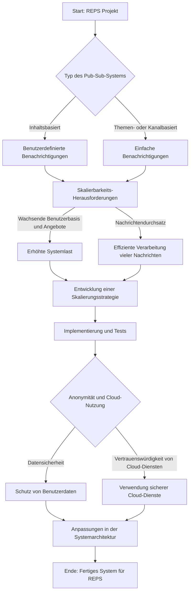

# Kapitel 1

# Analyse und Beschreibung des Problems: Publish-Subscribe-System für REPS

## 1. Typ des Publish-Subscribe-Systems
- **Inhaltsbasiert:** 
  - Das System ist inhaltsbasiert, was bedeutet, dass Kunden basierend auf spezifischen Suchkriterien Benachrichtigungen erhalten.
- **Themen- oder kanalbasiert:** 
  - Es wird überlegt, ob ein einfacheres themen- oder kanalbasiertes System ausreichend sein könnte.

## 2. Skalierbarkeits-Herausforderung
- **Wachsende Benutzerbasis und Immobilienangebote:** 
  - Eine effektive Skalierbarkeitsstrategie ist erforderlich, um mit der steigenden Last umzugehen.
- **Nachrichtendurchsatz:** 
  - Die Fähigkeit, eine große Anzahl von Nachrichten effizient zu verarbeiten, ist entscheidend.

## 3. Benachrichtigungsproblematik
- **Zuverlässigkeit:** 
  - Hohe Zuverlässigkeit bei der Benachrichtigungszustellung ist erforderlich.
- **Latenz:** 
  - Die Latenz zwischen dem Listing einer Immobilie und der Zustellung der Benachrichtigung sollte minimiert werden.

## 4. Anonymität und Cloud-Nutzung
- **Datensicherheit:** 
  - Die Sicherheit und Anonymität der Daten muss gewährleistet sein.
- **Vertrauenswürdigkeit der Cloud-Dienste:** 
  - Zusätzliche Maßnahmen können erforderlich sein, um die Sicherheit bei der Nutzung von Cloud-Diensten zu gewährleisten.

## 5. Literatur und bestehende Lösungen
- **Recherche:** 
  - Eine umfassende Untersuchung bestehender Pub-Sub-Systeme und ihrer Anwendungen ist notwendig.
- **Best Practices:** 
  - Identifikation von Best Practices und geeigneten Technologien.

## 6. Empfehlungen und Präsentation
- **Empfehlungserarbeitung:** 
  - Erarbeitung einer fundierten Empfehlung zur Auswahl und Implementierung des Pub-Sub-Systems.
- **Präsentation und Diskussion:** 
  - Vorbereitung einer detaillierten Präsentation und Diskussion für die Klasse und Dozenten.
