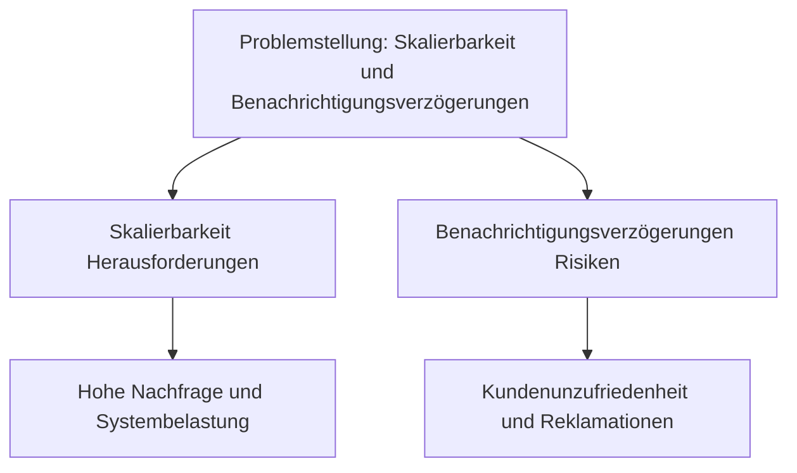
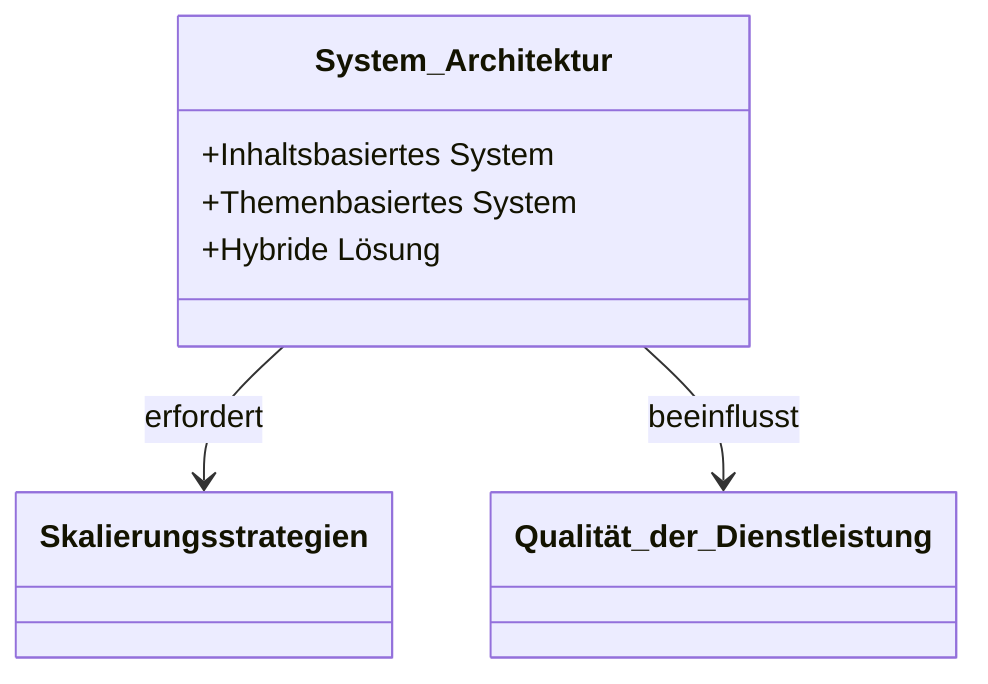
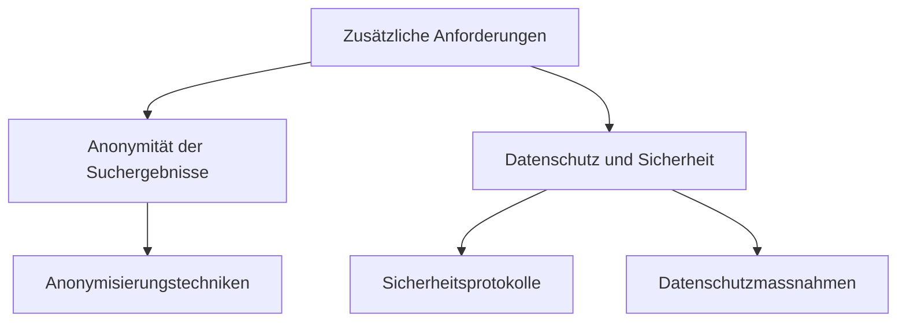
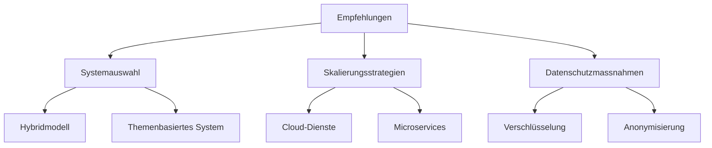
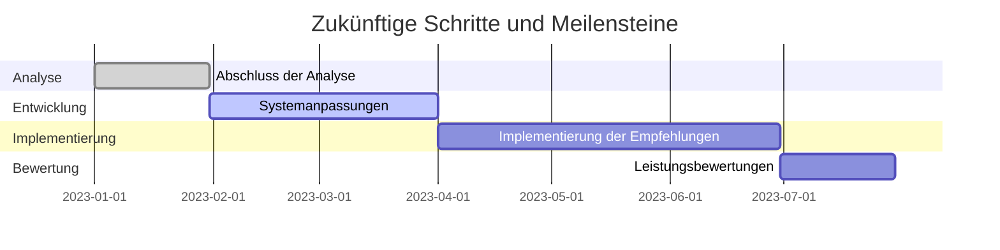

# Analyse und Beschreibung des Problems: Publish-Subscribe-System für REPS

### Problemstellung und Kontextanalyse

In der heutigen schnelllebigen und technologiegetriebenen Welt der Immobilienvermarktung steht das Unternehmen REPS vor einer herausfordernden Aufgabe. Sie haben ein innovatives Publish-Subscribe-System eingeführt, um ihren Kunden ein einzigartiges Erlebnis zu bieten: die Möglichkeit, Immobilien zu abonnieren, die ihren spezifischen Wünschen entsprechen, und in Echtzeit benachrichtigt zu werden, sobald eine passende Immobilie verfügbar wird. Diese fortschrittliche Herangehensweise an den Immobilienmarkt stellt jedoch auch eine Reihe von technischen und operationellen Herausforderungen dar.

Das Herzstück dieses Systems ist ein inhaltsbasiertes Publish-Subscribe-Modell. Während es auf den ersten Blick als eine ideale Lösung erscheint, um die Bedürfnisse der Kunden genau zu adressieren, bringt es auch signifikante Herausforderungen mit sich, insbesondere im Hinblick auf die Skalierbarkeit. Aufgrund der dynamischen Natur des Immobilienmarktes, gekennzeichnet durch ständige Fluktuationen und die rasche Veränderung von Kundenpräferenzen, muss das System in der Lage sein, mit einem hohen Volumen an Anfragen und Daten umzugehen. Diese Skalierbarkeit ist entscheidend, um ein nahtloses Kundenerlebnis zu gewährleisten und gleichzeitig die Integrität und Zuverlässigkeit des Systems aufrechtzuerhalten.

Ein weiteres wesentliches Element der Problemstellung ist das Risiko der Benachrichtigungsverzögerung. In einem Markt, der so zeitkritisch ist wie der Immobilienmarkt, kann jede Verzögerung in der Benachrichtigung potenzielle Kunden verärgern und zu Beschwerden führen. Dies ist besonders problematisch in einem Marktumfeld, in dem schnelle Entscheidungen und Reaktionen oft den Unterschied zwischen dem Erfolg und dem Verlust einer wertvollen Immobilienchance bedeuten.

Angesichts dieser Herausforderungen ist es für REPS unerlässlich, eine tiefgreifende technische Analyse des bestehenden Systems durchzuführen und die notwendigen Anpassungen vorzunehmen, um ein effizientes, reaktionsschnelles und kundenorientiertes Serviceerlebnis zu gewährleisten. Diese Analyse wird nicht nur die technischen Aspekte beleuchten, sondern auch strategische Überlegungen zur Skalierung und Qualitätssicherung des Dienstes einbeziehen, um eine solide Grundlage für zukünftige Entscheidungen und Entwicklungen zu schaffen.

### Technische Analyse

Die technische Analyse des Publish-Subscribe-Systems von REPS offenbart eine komplexe Mischung aus Herausforderungen und Möglichkeiten. Zunächst steht die Abwägung zwischen einem inhaltsbasierten und einem themenbasierten System im Vordergrund. Während das inhaltsbasierte System eine fein abgestimmte Anpassung an individuelle Kundenwünsche ermöglicht, könnte ein themenbasiertes System durch seine vereinfachte Struktur und geringere Komplexität in bestimmten Situationen effizienter sein. Eine sorgfältige Bewertung der spezifischen Anforderungen von REPS ist daher entscheidend, um das optimale Modell zu bestimmen. Es könnte sich herausstellen, dass eine hybride Lösung, die Elemente beider Systeme kombiniert, die beste Wahl darstellt, um sowohl spezifische Kundenbedürfnisse zu erfüllen als auch eine hohe Systemeffizienz zu gewährleisten.

Ein weiterer kritischer Aspekt der technischen Analyse ist die Skalierbarkeit des Systems. Angesichts der volatilen Natur des Immobilienmarktes und der potenziell hohen Anzahl von Benutzern und Anfragen muss das System in der Lage sein, sich dynamisch an verändernde Lasten anzupassen. Dies erfordert eine robuste Architektur und möglicherweise die Implementierung von Cloud-basierten Lösungen oder Microservices, die eine effiziente Ressourcennutzung und Skalierbarkeit ermöglichen. Ebenso wichtig ist die Berücksichtigung der Qualität der Dienstleistung (QoS). Parameter wie Latenz, Durchsatz und Verfügbarkeit müssen sorgfältig abgewogen werden, um sicherzustellen, dass das System auch unter Spitzenbelastungen reibungslos funktioniert und die Benutzererfahrung nicht beeinträchtigt wird.

Neben diesen grundlegenden Überlegungen zur Systemarchitektur und Leistung muss auch die Integration von Datenschutz- und Sicherheitsmassnahmen berücksichtigt werden, insbesondere im Hinblick auf die zusätzliche Anforderung von REPS, die Anonymität der Suchergebnisse zu wahren. Dies erfordert eine sorgfältige Planung, um sicherzustellen, dass das System die Privatsphäre der Nutzer schützt, während es gleichzeitig effiziente und präzise Suchergebnisse liefert. Dies könnte den Einsatz von fortschrittlichen Verschlüsselungstechniken oder die Entwicklung von Protokollen zur anonymen Datenverarbeitung erfordern.

Insgesamt erfordert die technische Analyse des Publish-Subscribe-Systems von REPS eine ausgewogene Kombination aus technischer Expertise und strategischer Planung. Die Entscheidungen, die in dieser Phase getroffen werden, sind entscheidend für die Zukunftsfähigkeit, Effizienz und Benutzerfreundlichkeit des Systems, und werden letztendlich bestimmen, wie gut das System die Bedürfnisse der Kunden von REPS erfüllt und wie es sich im dynamischen Umfeld des Immobilienmarktes behauptet.

### Berücksichtigung zusätzlicher Anforderungen

Die Herausforderungen, denen sich REPS gegenübersieht, erstrecken sich über die grundlegende Funktionalität des Publish-Subscribe-Systems hinaus und beinhalten zusätzliche, komplexe Anforderungen. Eine wesentliche davon ist die Gewährleistung der Anonymität der Suchergebnisse. Dies ist besonders heikel, da REPS darauf abzielt, Cloud-basierte Dienste zu nutzen, ohne diesen vollständig vertrauen zu müssen. Die Implementierung von Massnahmen zur Wahrung der Anonymität erfordert ein sorgfältiges Gleichgewicht zwischen Nutzerfreundlichkeit und Datenschutz. Es könnte notwendig sein, fortschrittliche Anonymisierungstechniken zu erforschen und einzusetzen, um diese Anforderung zu erfüllen, ohne die Leistung des Systems zu beeinträchtigen.

Neben der Anonymität ist auch der Datenschutz und die Sicherheit der Nutzerdaten von grosser Bedeutung. In einem Umfeld, in dem sensible Informationen wie persönliche Vorlieben und Suchkriterien gehandhabt werden, ist es unerlässlich, robuste Sicherheitsprotokolle zu implementieren. Diese Protokolle müssen sowohl den Schutz der Daten vor unbefugtem Zugriff sicherstellen als auch die Integrität des Systems gewährleisten. Die Herausforderung besteht darin, diese Sicherheitsmassnahmen so zu gestalten, dass sie effektiv sind, ohne die Benutzererfahrung zu beeinträchtigen oder die Leistung des Systems zu verlangsamen.

Diese zusätzlichen Anforderungen erfordern eine tiefgreifende technische Überlegung und sorgfältige Planung. Die Lösungen, die für diese Probleme entwickelt werden, müssen nahtlos in das bestehende System integriert werden und dürfen die grundlegende Funktionalität nicht beeinträchtigen. Dies erfordert ein hohes Mass an technischer Expertise und Kreativität, um ein System zu schaffen, das nicht nur effizient und benutzerfreundlich ist, sondern auch den hohen Anforderungen an Datenschutz und Sicherheit gerecht wird.

### Empfehlungen

Basierend auf der umfassenden technischen Analyse des Publish-Subscribe-Systems von REPS, lassen sich mehrere Empfehlungen ableiten. Zunächst ist es entscheidend, das geeignetste Systemmodell auszuwählen. Abhängig von den spezifischen Bedürfnissen und der erwarteten Nutzerzahl von REPS könnte eine Kombination aus inhalts- und themenbasierten Systemen die beste Wahl darstellen. Diese Hybridlösung würde es ermöglichen, die Vorteile beider Systeme zu nutzen: die spezifische Anpassungsfähigkeit inhaltsbasierter Systeme und die Effizienz und Einfachheit themenbasierter Modelle.

Hinsichtlich der Skalierung des Systems sollten Cloud-basierte Dienste und Microservice-Architekturen in Betracht gezogen werden. Diese Technologien bieten eine hohe Flexibilität und Skalierbarkeit, was für die Bewältigung von Lastspitzen und die Aufrechterhaltung einer konstanten Leistung unerlässlich ist. Zusätzlich sollte REPS in effiziente Datenverarbeitungs- und Caching-Strategien investieren, um die Latenzzeiten zu minimieren und die Systemreaktivität zu maximieren.

In Bezug auf Datenschutz und Sicherheit sollte REPS fortschrittliche Verschlüsselungsmethoden und Anonymisierungstechniken implementieren. Diese Massnahmen sind entscheidend, um die Privatsphäre der Nutzer zu schützen und gleichzeitig die Integrität und Sicherheit des Systems zu gewährleisten. Es ist wichtig, dass diese Sicherheitsprotokolle regelmässig überprüft und aktualisiert werden, um mit den sich ständig weiterentwickelnden Bedrohungen Schritt zu halten.

Abschliessend sollte REPS eine kontinuierliche Überwachung und Wartung des Systems etablieren, um sicherzustellen, dass es stets den neuesten Standards entspricht und effizient funktioniert. Dies umfasst regelmässige Leistungsbewertungen, Updates und Anpassungen an die sich ändernden Anforderungen und Markttrends.

Diese Empfehlungen sollen REPS dabei unterstützen, ein robustes, skalierbares und sicheres Publish-Subscribe-System zu betreiben, das nicht nur den aktuellen Anforderungen gerecht wird, sondern auch flexibel genug ist, um sich an zukünftige Entwicklungen anzupassen.

### Zusammenfassung und Ausblick

Aus der durchgeführten Analyse und den daraus resultierenden Empfehlungen ergibt sich ein klarer Fahrplan für REPS, um ihr Publish-Subscribe-System optimal zu gestalten. Die Schlüsselerkenntnisse zeigen, dass eine sorgfältige Abwägung zwischen verschiedenen Systemmodellen und eine gezielte Anpassung an die spezifischen Bedürfnisse des Immobilienmarktes entscheidend sind. Die Wahl eines hybriden Systems, das sowohl inhalts- als auch themenbasierte Elemente integriert, scheint eine vielversprechende Lösung zu sein, um sowohl Effizienz als auch Benutzerfreundlichkeit zu maximieren.

Die Bedeutung einer skalierbaren Architektur, unterstützt durch Cloud-Technologien und Microservices, kann nicht hoch genug eingeschätzt werden. Diese Technologien bieten die notwendige Flexibilität und Kapazität, um mit der wechselnden Dynamik und dem Volumen des Immobilienmarktes Schritt zu halten. Darüber hinaus sind die Implementierung von Datenschutzmassnahmen und die fortlaufende Aktualisierung von Sicherheitsprotokollen unerlässlich, um das Vertrauen der Nutzer zu gewährleisten und die Integrität des Systems zu schützen.

In der Zukunft muss REPS aufmerksam bleiben und das System kontinuierlich an die sich wandelnden Marktbedingungen und technologischen Entwicklungen anpassen. Dies beinhaltet die regelmässige Überprüfung der Systemleistung, die Anpassung an neue Anforderungen und die Integration neuer Technologien, um wettbewerbsfähig zu bleiben.

Abschliessend lässt sich sagen, dass REPS mit einem durchdachten und gut umgesetzten Publish-Subscribe-System eine starke Position im Immobilienmarkt einnehmen kann. Durch die Berücksichtigung der herausgearbeiteten Empfehlungen und eine kontinuierliche Anpassung und Verbesserung des Systems kann das Unternehmen nicht nur aktuellen Herausforderungen begegnen, sondern auch zukünftige Chancen optimal nutzen.

