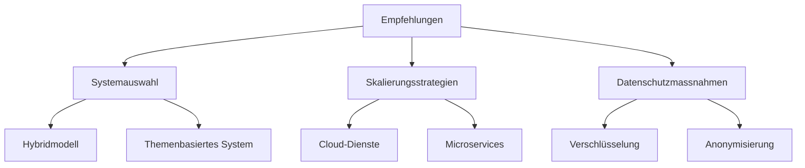

# Situationsanalyse und Empfehlung

### Empfehlungen

Basierend auf der umfassenden technischen Analyse des Publish-Subscribe-Systems von REPS, lassen sich mehrere Empfehlungen ableiten. Zunächst ist es entscheidend, das geeignetste Systemmodell auszuwählen. Abhängig von den spezifischen Bedürfnissen und der erwarteten Nutzerzahl von REPS könnte eine Kombination aus inhalts- und themenbasierten Systemen die beste Wahl darstellen. Diese Hybridlösung würde es ermöglichen, die Vorteile beider Systeme zu nutzen: die spezifische Anpassungsfähigkeit inhaltsbasierter Systeme und die Effizienz und Einfachheit themenbasierter Modelle.

Hinsichtlich der Skalierung des Systems sollten Cloud-basierte Dienste und Microservice-Architekturen in Betracht gezogen werden. Diese Technologien bieten eine hohe Flexibilität und Skalierbarkeit, was für die Bewältigung von Lastspitzen und die Aufrechterhaltung einer konstanten Leistung unerlässlich ist. Zusätzlich sollte REPS in effiziente Datenverarbeitungs- und Caching-Strategien investieren, um die Latenzzeiten zu minimieren und die Systemreaktivität zu maximieren.

In Bezug auf Datenschutz und Sicherheit sollte REPS fortschrittliche Verschlüsselungsmethoden und Anonymisierungstechniken implementieren. Diese Massnahmen sind entscheidend, um die Privatsphäre der Nutzer zu schützen und gleichzeitig die Integrität und Sicherheit des Systems zu gewährleisten. Es ist wichtig, dass diese Sicherheitsprotokolle regelmässig überprüft und aktualisiert werden, um mit den sich ständig weiterentwickelnden Bedrohungen Schritt zu halten.

Abschliessend sollte REPS eine kontinuierliche Überwachung und Wartung des Systems etablieren, um sicherzustellen, dass es stets den neuesten Standards entspricht und effizient funktioniert. Dies umfasst regelmässige Leistungsbewertungen, Updates und Anpassungen an die sich ändernden Anforderungen und Markttrends.

Diese Empfehlungen sollen REPS dabei unterstützen, ein robustes, skalierbares und sicheres Publish-Subscribe-System zu betreiben, das nicht nur den aktuellen Anforderungen gerecht wird, sondern auch flexibel genug ist, um sich an zukünftige Entwicklungen anzupassen.

