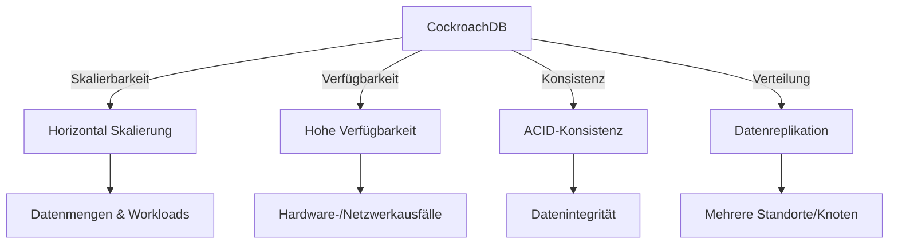

# Test  

Test2

```mermaid

graph TD;
A[CockroachDB] -->|Skalierbarkeit| B[Horizontal Skalierung]
A -->|Verfügbarkeit| C[Hohe Verfügbarkeit]
A -->|Konsistenz| D[ACID-Konsistenz]
A -->|Verteilung| E[Datenreplikation]
B --> F[Datenmengen & Workloads]
C --> G[Hardware-/Netzwerkausfälle]
D --> H[Datenintegrität]
E --> I[Mehrere Standorte/Knoten]
```

## Weiter Text 

# Funktionstest

Siehst du das?  
Jep =)  
NICEEE  

# Test
